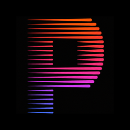

  

<h1 align="center">Patrimony</h1>

<strong>Track your net worth, one month at a time.</strong>

  <a href="https://getpatrimony.com">getpatrimony.com</a> ·
  <a href="https://gabremoku.github.io/patrimony/">Landing page</a> ·
  <a href="https://getpatrimony.com/learn">How it works</a>

  

---

Patrimony is a personal net worth tracker built around a calm monthly
habit — not daily market-watching, not linked bank feeds. Each month you
enter the current value of your accounts, and Patrimony turns that into a
clear picture over time: a net worth chart, month-over-month change, and a
currency-aware dashboard.

## What it does

- **Multi-currency accounts** — liquid, invested, retirement and term
  accounts, each in its own currency, converted automatically to your
  display currency.
- **Goal Calculator** — set a target net worth and track progress toward it.
- **Benchmark comparison** — compare your own growth against a reference
  index, year over year.
- **Term investments** — bonds and fixed-term deposits that carry their
  value forward on their own, without re-typing every month.
- **Physical assets, kept separate** — track a home or a car alongside your
  financial net worth, without conflating the two.
- **Installable everywhere** — works in the browser and installs as a PWA
  on desktop and mobile.

## Built to be calm, not addictive

No push notifications about market swings, no daily price feed to refresh
compulsively. No bank account linking or automatic transaction imports —
you enter the numbers, on purpose, once a month. No third-party tracking
scripts running before you've even logged in. Your data can be exported at
any time, and deleted whenever you want.

## This repository

This repo only hosts the public [landing page](https://gabremoku.github.io/patrimony/)
— a single self-contained `index.html`, no build step, no external
requests. The app itself runs at [getpatrimony.com](https://getpatrimony.com).

---

  A project by <a href="https://gabrieledenaro.com/chi-sono">Gabriele Denaro</a>.

